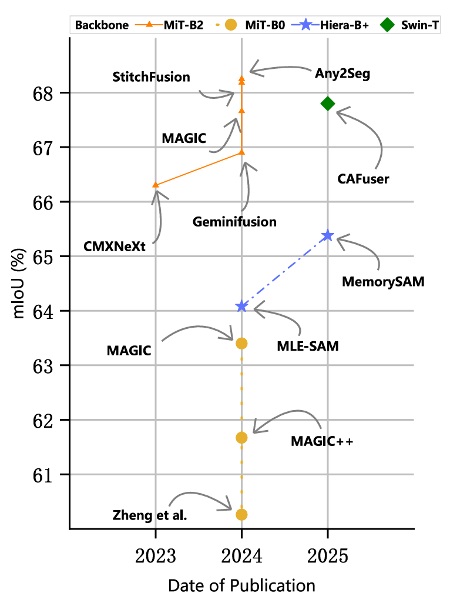
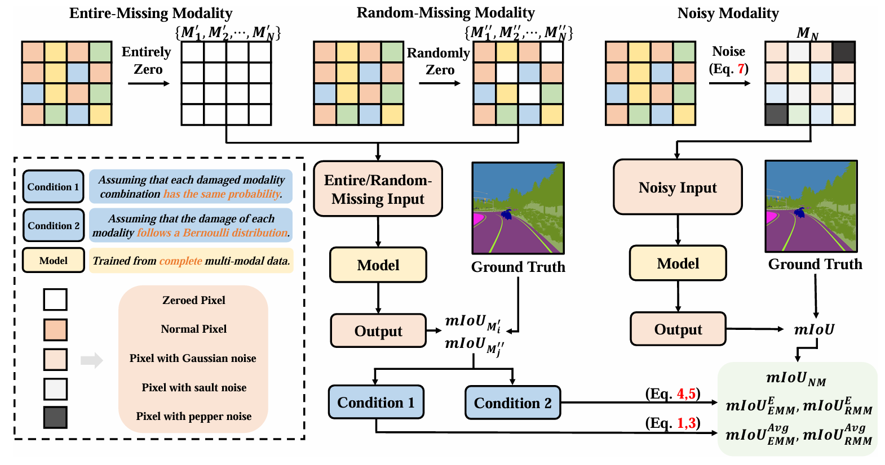

# <p align="center"><strong>Benchmarking Multi-modal Semantic Segmentation under Sensor Failures: Missing and Noisy Modality Robustness</strong></p>
<div align="center">
Chenfei Liao<sup>1,*</sup>, Kaiyu Lei<sup>2,*</sup>, Xu Zheng<sup>1,3</sup> (Project lead), Junha Moon<sup>1</sup>, Zhixiong Wang<sup>1</sup>, 
    
Yixuan Wang<sup>1</sup>, Danda Pani Paudel<sup>3</sup>, Luc Van Gool<sup>3</sup>, Xuming Hu<sup>1,4</sup><sup></sup> (Corresponding author)

<div align="center">
<sup>1</sup>HKUST(GZ), <sup>2</sup>XJTU, <sup>3</sup>INSAIT, Sofia University “St. Kliment Ohridski”, <sup>4</sup>CSE, HKUST
</div>

<div align="center">

[](https://arxiv.org/abs/2503.18445)

</div>

<div align="left">
  
## Abstract

Multi-modal semantic segmentation (MMSS) addresses the limitations of single-modality data by integrating complementary information across modalities. 
Despite notable progress, a significant gap persists between research and real-world deployment due to variability and uncertainty in multi-modal data quality. 
Robustness has thus become essential for practical MMSS applications. However, the absence of standardized benchmarks for evaluating robustness hinders further advancement.
To address this, we first survey existing MMSS literature and categorize representative methods to provide a structured overview. 
We then introduce a robustness benchmark that evaluates MMSS models under three scenarios: Entire-Missing Modality (EMM), Random-Missing Modality (RMM), and Noisy Modality (NM). 
From a probabilistic standpoint, we model modality failure under two conditions: (1) all damaged combinations are equally probable; (2) each modality fails independently following a Bernoulli distribution. 
Based on these, we propose four metrics—mIoU<sup>Avg</sup><sub>EMM</sub>, mIoU<sup>E</sup><sub>EMM</sub>, mIoU<sup>Avg</sup><sub>RMM</sub>, and mIoU<sup>E</sup><sub>RMM</sub>—to assess model robustness under EMM and RMM. 
This work provides the first dedicated benchmark for MMSS robustness, offering new insights and tools to advance the field. 

</div>

<div align="left">
    
## Related Work

</div>

### History of MMSS methods

<div align="center">
    
</div>


### Comparison of modality robustness across MMSS methods. RMM: Random-Missing Modality; EMM: Entire-Missing Modality; NM: Noisy Modality.

| **Work**               | **Publication** | **RMM**  | **EMM**  | **NM**  |
|------------------------|----------------|-----------------------------------|-----------------------------------|-------------------------|
| MCubesNet              | CVPR2022       | ❌                                | ❌                                | ❌                      |
| TokenFusion            | CVPR2022       | ❌                                | ❌                                | ❌                      |
| CMXNeXt                | CVPR2023       | ❌                                | ❌                                | ❌                      |
| GeminiFusion           | ICML2024       | ❌                                | ❌                                | ❌                      |
| MAGIC                  | ECCV2024       | ❌                                | ✅                                | ✅                      |
| Any2Seg                | ECCV2024       | ❌                                | ✅                                | ✅                      |
| FPT                    | IV2024         | ❌                                | ✅                                | ✅                      |
| MAGIC++                | Arxiv2024      | ❌                                | ✅                                | ✅                      |
| MLE-SAM                | Arxiv2024      | ❌                                | ✅                                | ✅                      |
| AnySeg                 | Arxiv2024      | ❌                                | ✅                                | ❌                      |
| StitchFusion           | Arxiv2024      | ❌                                | ❌                                | ❌                      |
| CAFuser                | RAL2025        | ❌                                | ❌                                | ❌                      |
| MemorySAM              | Arxiv2025      | ❌                                | ❌                                | ❌                      |

<div align="left">

## Framework

<div align="center">
    
</div>

    
## Results

</div>

<div align="center">

### EMM evaluation results

  | Model           | mIoU<sup>Avg</sup><sub>EMM</sub> | mIoU<sup>E</sup><sub>EMM</sub> (p=0.2) | mIoU<sup>E</sup><sub>EMM</sub> (p=0.1) | mIoU<sup>E</sup><sub>EMM</sub> (p=0.05) |
|-----------------|----------------------------------|----------------------------------------|----------------------------------------|-----------------------------------------|
| CMNeXt          | 37.90                            | 54.46                                  | 60.41                                  | 63.38                                   |
| GeminiFusion    | 37.07                            | 54.33                                  | 60.62                                  | 63.77                                   |
| MAGIC           | 44.97                            | 58.66                                  | 62.68                                  | 64.47                                   |
| MAGIC++         | 44.85                            | 59.18                                  | 63.52                                  | 65.50                                   |
| StitchFusion    | 41.98                            | 58.02                                  | 63.29                                  | 65.80                                   |


### RMM Evaluation Results (r=0.75)

| Model           | mIoU<sup>Avg</sup><sub>RMM</sub> | mIoU<sup>E</sup><sub>RMM</sub> (p=0.2) | mIoU<sup>E</sup><sub>RMM</sub> (p=0.1) | mIoU<sup>E</sup><sub>RMM</sub> (p=0.05) |
|-----------------|----------------------------------|----------------------------------------|----------------------------------------|-----------------------------------------|
| CMNeXt          | 42.17                            | 56.66                                  | 61.60                                  | 63.99                                   |
| GeminiFusion    | 39.78                            | 55.88                                  | 61.47                                  | 64.22                                   |
| MAGIC           | 45.30                            | 58.77                                  | 62.72                                  | 64.49                                   |
| MAGIC++         | 47.06                            | 59.81                                  | 63.78                                  | 65.62                                   |
| StitchFusion    | 45.16                            | 59.44                                  | 64.02                                  | 66.17                                   |

### RMM Evaluation Results (r=0.5)

| Model           | mIoU<sup>Avg</sup><sub>RMM</sub> | mIoU<sup>E</sup><sub>RMM</sub> (p=0.2) | mIoU<sup>E</sup><sub>RMM</sub> (p=0.1) | mIoU<sup>E</sup><sub>RMM</sub> (p=0.05) |
|-----------------|----------------------------------|----------------------------------------|----------------------------------------|-----------------------------------------|
| CMNeXt          | 47.49                            | 58.85                                  | 62.68                                  | 64.53                                   |
| GeminiFusion    | 42.41                            | 57.30                                  | 62.25                                  | 64.62                                   |
| MAGIC           | 48.19                            | 59.53                                  | 63.01                                  | 64.61                                   |
| MAGIC++         | 49.31                            | 60.50                                  | 64.07                                  | 65.75                                   |
| StitchFusion    | 48.33                            | 60.58                                  | 64.53                                  | 66.41                                   |

### RMM Evaluation Results (r=0.25)

| Model           | mIoU<sup>Avg</sup><sub>RMM</sub> | mIoU<sup>E</sup><sub>RMM</sub> (p=0.2) | mIoU<sup>E</sup><sub>RMM</sub> (p=0.1) | mIoU<sup>E</sup><sub>RMM</sub> (p=0.05) |
|-----------------|----------------------------------|----------------------------------------|----------------------------------------|-----------------------------------------|
| CMNeXt          | 53.61                            | 61.28                                  | 63.86                                  | 65.11                                   |
| GeminiFusion    | 49.74                            | 60.55                                  | 63.91                                  | 65.46                                   |
| MAGIC           | 51.61                            | 60.46                                  | 60.37                                  | 64.76                                   |
| MAGIC++         | 53.92                            | 62.07                                  | 64.78                                  | 66.08                                   |
| StitchFusion    | 53.10                            | 62.34                                  | 65.39                                  | 66.85                                   |


### NM Evaluation Results

| **Class**       | **CMNeXt** Low |  **CMNeXt** Mid. |  **CMNeXt** High | **GeminiFusion** Low |  **GeminiFusion** Mid. | **GeminiFusion** High | **MAGIC** Low | **MAGIC** Mid. |**MAGIC** High | **MAGIC++** Low |**MAGIC++** Mid. |**MAGIC++** High | **StitchFusion** Low |**StitchFusion** Mid. |**StitchFusion** High |
|-----------------|---------------|------|------|----------------------|------|------|---------------|------|------|-----------------|------|------|----------------------|------|------|
| Building        | 54.46         | 6.39 | 0    | 0                    | 0    | 0    | 45.88         | 28.22| 9.58 | 59.04           | 41.54| 16.42| 51.72                | 26.35| 3.84 |
| Fence           | 12.11         | 4.88 | 1.27 | 0.21                 | 0    | 0    | 13.60         | 4.55 | 0.03 | 5.85            | 1.53 | 0.75 | 12.48                | 7.90 | 1.91 |
| Other           | 0             | 0    | 0    | 0                    | 0    | 0    | 0             | 0    | 0    | 0               | 0    | 0    | 0                    | 0    | 0    |
| Pedestrian      | 32.85         | 14.10| 0.07 | 0.14                 | 0    | 0    | 16.38         | 6.99 | 0.12 | 24.32           | 16.54| 6.15 | 17.38                | 9.43 | 2.17 |
| Pole            | 45.34         | 24.70| 4.29 | 6.74                 | 0.21 | 0    | 12.60         | 2.70 | 0.02 | 26.05           | 13.46| 5.06 | 14.84                | 6.17 | 1.32 |
| RoadLine        | 43.74         | 18.88| 1.25 | 0.01                 | 0    | 0    | 54.38         | 37.39| 15.12| 62.53           | 48.58| 30.57| 48.90                | 35.49| 22.21|
| Road            | 87.94         | 56.83| 3.00 | 2.54                 | 0    | 0    | 75.74         | 61.59| 49.11| 91.85           | 78.38| 68.66| 79.10                | 68.19| 51.83|
| SideWalk        | 52.54         | 27.61| 5.11 | 0.23                 | 0    | 0    | 39.26         | 14.25| 0.11 | 47.56           | 32.43| 8.09 | 35.57                | 24.91| 10.31|
| Vegetation      | 34.46         | 10.34| 5.60 | 8.96                 | 8.27 | 7.48 | 16.91         | 12.77| 1.21 | 31.23           | 9.89 | 10.73| 43.20                | 32.35| 16.84|
| Cars            | 51.99         | 26.13| 0.14 | 0.04                 | 0    | 0    | 48.73         | 31.42| 1.00 | 53.99           | 26.65| 14.37| 41.69                | 31.69| 21.36|
| Wall            | 4.72          | 0.15 | 0.01 | 0                    | 0    | 0    | 21.49         | 8.69 | 0.25 | 21.52           | 7.54 | 1.00 | 10.83                | 4.80 | 2.42 |
| Trafficsign     | 27.39         | 6.22 | 0.04 | 0.01                 | 0    | 0    | 9.94          | 5.90 | 2.31 | 15.88           | 6.84 | 0.60 | 10.31                | 4.33 | 0.70 |
| Sky             | 95.43         | 47.66| 7.81 | 97.65                | 94.17| 74.96| 41.01         | 17.97| 10.22| 75.31           | 9.84 | 1.18 | 89.21                | 76.61| 40.11|
| Ground          | 2.17          | 0.39 | 0    | 0                    | 0    | 0    | 1.75          | 0.80 | 0.00 | 0.64            | 1.21 | 0.69 | 0.74                 | 0.76 | 0.21 |
| Bridge          | 4.03          | 0.23 | 0    | 0                    | 0    | 0    | 10.24         | 2.37 | 0.01 | 36.19           | 24.40| 1.70 | 11.07                | 2.50 | 2.15 |
| RailTrack       | 20.78         | 0.39 | 0    | 0                    | 0    | 0    | 0.78          | 0.41 | 0.21 | 24.51           | 6.80 | 0.40 | 10.81                | 3.36 | 1.47 |
| GroundRail      | 9.39          | 2.08 | 0.13 | 0.04                 | 0    | 0    | 8.52          | 2.67 | 0.07 | 13.28           | 7.88 | 4.26 | 9.26                 | 4.01 | 0.88 |
| TrafficLight    | 48.61         | 25.85| 2.93 | 3.42                 | 0.01 | 0    | 25.87         | 8.20 | 0.90 | 46.87           | 24.93| 3.52 | 27.99                | 9.90 | 1.60 |
| Static          | 14.51         | 1.94 | 0.01 | 0                    | 0    | 0    | 8.58          | 2.58 | 0.05 | 12.3            | 5.47 | 2.02 | 8.35                 | 3.72 | 1.16 |
| Dynamic         | 5.71          | 0.64 | 0    | 0                    | 0    | 0    | 2.96          | 0.94 | 0    | 5.55            | 2.30 | 0.15 | 3.87                 | 0.94 | 0    |
| Water           | 33.43         | 19.92| 2.13 | 6.35                 | 0    | 0    | 5.14          | 2.97 | 0.34 | 3.90            | 1.79 | 0.49 | 0.05                 | 0.01 | 0    |
| Terrain         | 48.80         | 26.52| 13.12| 10.06                | 0.88 | 0    | 29.26         | 17.43| 2.64 | 42.75           | 22.17| 6.88 | 33.76                | 20.54| 5.45 |
| TwoWheeler      | 17.54         | 5.40 | 0    | 0                    | 0    | 0    | 17.22         | 5.93 | 0    | 14.00           | 6.86 | 2.16 | 16.78                | 10.82| 1.49 |
| Bus             | 60.42         | 32.25| 0.39 | 0.18                 | 0    | 0    | 37.79         | 28.11| 5.93 | 53.28           | 31.44| 20.52| 36.69                | 38.30| 38.37|
| Truck           | 72.42         | 49.64| 10.45| 1.49                 | 0    | 0    | 56.60         | 27.94| 0.30 | 59.52           | 29.19| 11.01| 8.20                 | 4.76 | 3.40 |
| **mIoU<sup></sup><sub>NM</sup>**     | **35.23**     | **16.37**| **2.31**| **5.52**        | **4.14**| **3.30**| **24.03** | **13.31**| **3.98**| **33.12**      | **18.31**| **8.70**| **24.91**           | **17.11**| **9.25** |


</div>


<div align="left">
    
## News
⭐ If you find any problems in our code, please contact us! We will fix them as soon as possible! 

📧 lcfgreat624@gmail.com, cliao127@connect.hkust-gz.edu.cn

🚩 2025/3/25 Our paper has been online on Arxiv: https://arxiv.org/pdf/2503.18445

🚩 2025/3/25 We release the first version of our souce code! 

🚩 2025/4/3 Our paper has been accepted by CVPR 2025 Workshop: TMM-OpenWorld!

🚩 2025/4/9 Our paper has been selected as oral! (Top 6 papers)
## Quick Start

The entire project is based on [DELIVER](https://github.com/jamycheung/DELIVER). 

You only need to git clone [DELIVER](https://github.com/jamycheung/DELIVER), and replace the val_mm.py file with val_mm_EMM.py, val_mm_RMM.py, or val_mm_NM.py.


## References

If you find this project helpful, please consider citing the following paper:
```
@misc{liao2025benchmarkingmultimodalsemanticsegmentation,
      title={Benchmarking Multi-modal Semantic Segmentation under Sensor Failures: Missing and Noisy Modality Robustness}, 
      author={Chenfei Liao and Kaiyu Lei and Xu Zheng and Junha Moon and Zhixiong Wang and Yixuan Wang and Danda Pani Paudel and Luc Van Gool and Xuming Hu},
      year={2025},
      eprint={2503.18445},
      archivePrefix={arXiv},
      primaryClass={cs.CV},
      url={https://arxiv.org/abs/2503.18445}, 
}
```


</div>
